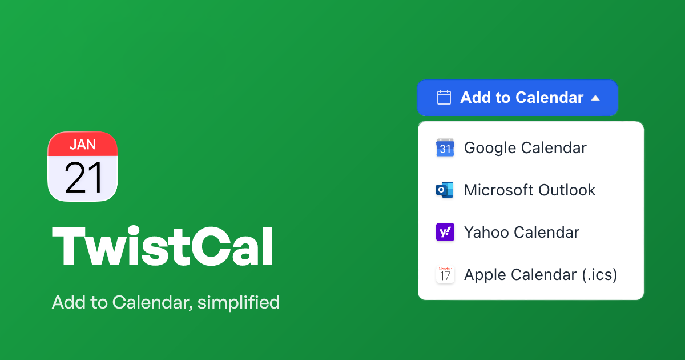

# TwistCal

[](https://www.npmjs.com/package/@freshjuice/twistcal)
[](LICENSE)
[](https://github.com/freshjuice-dev/twistcal/stargazers)
[](https://github.com/freshjuice-dev/twistcal/network/members)

Lightweight, zero-dependency **Add to Calendar** web component. Shadow DOM, Apache-2.0, 19 KB minified (11 KB slim).

Three ways to use it:

1. **Web component** — `<twist-cal>` renders a styled dropdown button
2. **Declarative triggers** — `data-twistcal` attributes on any element
3. **Programmatic API** — import the URL generators and ICS builder directly

## Install

```bash
npm install @freshjuice/twistcal
```

Or load from a CDN — no build step required:

```html
<script src="https://cdn.jsdelivr.net/npm/@freshjuice/twistcal/dist/twistcal.min.js"></script>
```

### Build variants

| File | Format | Size | Icons | Languages |
|------|--------|------|-------|-----------|
| `dist/twistcal.min.js` | IIFE | 19 KB | Yes | All 12 |
| `dist/twistcal.slim.min.js` | IIFE | 11 KB | No | All 12 |
| `dist/twistcal.esm.min.js` | ESM | 19 KB | Yes | All 12 |
| `dist/twistcal.slim.esm.min.js` | ESM | 11 KB | No | All 12 |
| `dist/twistcal.{lang}.min.js` | IIFE | 17 KB | Yes | Single lang |
| `dist/twistcal.{lang}.slim.min.js` | IIFE | 9 KB | No | Single lang |

CDN (self-executing, no build step):

```html
<!-- Full build with icons -->
<script src="https://cdn.jsdelivr.net/npm/@freshjuice/twistcal/dist/twistcal.min.js"></script>

<!-- Slim build, no icons -->
<script src="https://cdn.jsdelivr.net/npm/@freshjuice/twistcal/dist/twistcal.slim.min.js"></script>

<!-- Single language (e.g. German only) -->
<script src="https://cdn.jsdelivr.net/npm/@freshjuice/twistcal/dist/twistcal.de.min.js"></script>
```

---

## 1. Web component

Drop `<twist-cal>` on the page. It renders a button with a dropdown menu. All styles live in a Shadow DOM root — no bleed in either direction.

```html
<script src="https://cdn.jsdelivr.net/npm/@freshjuice/twistcal/dist/twistcal.min.js"></script>

<twist-cal
  title="Product Launch Webinar"
  start="2026-02-10T14:00:00"
  end="2026-02-10T15:30:00"
  location="Online"
  description="Join us for the launch of TwistCal v1.">
</twist-cal>
```

### Attributes

| Attribute | Required | Description |
|-----------|----------|-------------|
| `title` | yes | Event title (calendar subject) |
| `start` | yes | Start datetime — any value `new Date()` understands |
| `end` | yes | End datetime |
| `description` | no | Event description (calendar body) |
| `location` | no | Event location |
| `url` | no | Event URL (included in .ics) |
| `timezone` | no | IANA timezone (e.g. `Europe/Oslo`). When set, naive `start`/`end` are interpreted as wall-clock in that zone, converted to UTC. DST-aware. Ignored if `start`/`end` already carry an offset. |
| `label` | no | Button text. Default: auto-detected from `lang` or `Add to Calendar` |
| `lang` | no | Language code (`en`, `de`, `es`, `fr`, `it`, `pt`, `nl`, `pl`, `uk`, `ru`, `ja`, `zh`). Auto-detected from `<html lang>` or `navigator.language` if omitted. |
| `variant` | no | Button style: `solid` (default) or `outline` (white bg, dark border, dark text) |
| `show-icons` | no | `true` (default) or `false` — show/hide brand icons in dropdown |
| `calendars` | no | Comma-separated list of calendars to show, in order: `google,outlook,yahoo,ics`. Default: all four. Aliases: `ics` or `ical` both work. Also accepts `services` as an alias. |

### Calendar selection

Show only the calendars you want, in the order you want:

```html
<!-- Google + Apple Calendar only -->
<twist-cal calendars="google,ics" title="..." start="..." end="...">
</twist-cal>

<!-- Single calendar — effectively a download button -->
<twist-cal calendars="ics" label="Download .ics" title="..." start="..." end="...">
</twist-cal>
```

### Rich data via JSON

For long descriptions or structured data, pass event as JSON inside the element:

```html
<twist-cal label="Add to my calendar">
  <script type="application/json">
  {
    "title": "Quarterly Review — Q1 2026",
    "start": "2026-03-15T09:00:00",
    "end": "2026-03-15T10:00:00",
    "location": "Conference Room B, 4th Floor",
    "description": "Bring your Q1 metrics.\nDial-in: +1-555-0100, code 4521#",
    "url": "https://twistcal.com/demo"
  }
  </script>
</twist-cal>
```

### Styling

The component is style-isolated by Shadow DOM. Override CSS custom properties on the host:

```css
twist-cal {
  --tc-btn-bg: #dc2626;
  --tc-btn-bg-hover: #b91c1c;
  --tc-radius: 4px;
}
```

**Button:**

| Property | Default | Description |
|----------|---------|-------------|
| `--tc-btn-bg` | `#2563eb` | Button background |
| `--tc-btn-bg-hover` | `#1d4ed8` | Button background on hover |
| `--tc-btn-border` | `none` | Button border (use for custom variants) |
| `--tc-btn-padding` | `8px 16px` | Button padding |
| `--tc-btn-fs` | `14px` | Button font size |
| `--tc-btn-fw` | `600` | Button font weight |
| `--tc-btn-gap` | `6px` | Gap between label and caret |
| `--tc-text` | `#fff` | Button text color |
| `--tc-border` | `#111` | Outline variant border color |
| `--tc-caret-size` | `4px` | Caret triangle size |

**Menu:**

| Property | Default | Description |
|----------|---------|-------------|
| `--tc-menu-bg` | `#fff` | Menu background |
| `--tc-menu-border` | `#e5e7eb` | Menu border color |
| `--tc-menu-shadow` | `0 4px 16px rgba(0,0,0,0.12)` | Menu box shadow |
| `--tc-menu-padding` | `4px` | Menu inner padding |
| `--tc-menu-min-w` | `200px` | Menu minimum width |
| `--tc-menu-gap` | `4px` | Gap between button and menu |

**Menu items:**

| Property | Default | Description |
|----------|---------|-------------|
| `--tc-item-color` | `#1f2937` | Item text color |
| `--tc-item-hover-bg` | `#f3f4f6` | Item hover background |
| `--tc-item-padding` | `8px 12px` | Item padding |
| `--tc-item-fs` | `14px` | Item font size |
| `--tc-item-gap` | `8px` | Gap between icon and text |
| `--tc-item-radius` | `6px` | Item border radius |
| `--tc-icon-size` | `16px` | Icon size |

**Shared:**

| Property | Default | Description |
|----------|---------|-------------|
| `--tc-radius` | `8px` | Button + menu border radius |
| `--tc-font` | system stack | Font family |
| `--tc-focus` | `2px solid #60a5fa` | Focus ring outline |
| `--tc-focus-offset` | `2px` | Focus ring offset |

---

## 2. Declarative triggers (custom buttons)

Use your own buttons, links, or divs. Add `data-twistcal` to any element and it becomes a calendar trigger — no JS needed. Auto-initializes on `DOMContentLoaded`.

```html
<script src="https://cdn.jsdelivr.net/npm/@freshjuice/twistcal/dist/twistcal.min.js"></script>

<!-- Google Calendar -->
<button data-twistcal
  data-twistcal-action="google"
  data-twistcal-title="Team Sync"
  data-twistcal-start="2026-01-15T10:00:00"
  data-twistcal-end="2026-01-15T11:00:00"
  data-twistcal-location="Room A">
  Add to Google
</button>

<!-- Outlook -->
<a href="#" data-twistcal
  data-twistcal-action="outlook"
  data-twistcal-title="Team Sync"
  data-twistcal-start="2026-01-15T10:00:00"
  data-twistcal-end="2026-01-15T11:00:00">
  Add to Outlook
</a>

<!-- Download .ics -->
<button data-twistcal
  data-twistcal-action="ics"
  data-twistcal-title="Team Sync"
  data-twistcal-start="2026-01-15T10:00:00"
  data-twistcal-end="2026-01-15T11:00:00">
  Download .ics
</button>
```

### Trigger attributes

| Attribute | Required | Description |
|----------|----------|-------------|
| `data-twistcal` | yes | Marks the element as a trigger |
| `data-twistcal-action` | yes | `google` \| `outlook` \| `yahoo` \| `ics` |
| `data-twistcal-title` | yes | Event title |
| `data-twistcal-start` | yes | Start datetime |
| `data-twistcal-end` | yes | End datetime |
| `data-twistcal-description` | no | Event description |
| `data-twistcal-location` | no | Event location |
| `data-twistcal-url` | no | Event URL (.ics only) |
| `data-twistcal-timezone` | no | IANA timezone |

### Manual binding

If you add triggers dynamically (e.g. after an AJAX load), call `autoInit` on the new container:

```js
import { autoInit } from '@freshjuice/twistcal';

// After injecting HTML:
autoInit(document.getElementById('new-content'));
```

Or bind a single element with an explicit event object (skips attribute parsing):

```js
import { bindTrigger } from '@freshjuice/twistcal';

const event = { title: 'Team Sync', start: '2026-01-15T10:00:00', end: '2026-01-15T11:00:00' };
bindTrigger(document.getElementById('my-btn'), 'google', event);
```

---

## 3. Programmatic API

Full control — generate URLs or ICS strings yourself, wire them to anything:

```js
import {
  createButton,
  generateICS,
  googleUrl,
  outlookUrl,
  yahooUrl,
  downloadICS,
  detectLanguage,
  getTranslation,
  supportedLanguages
} from '@freshjuice/twistcal';

const event = {
  title: 'Coffee with the Team',
  start: '2026-01-20T11:00:00',
  end: '2026-01-20T11:45:00',
  location: 'Blue Bottle, 3rd St',
  description: 'Casual sync. No agenda.'
};

// Mount a full dropdown button
createButton(document.getElementById('mount'), event);

// Get a deep link URL string
const url = googleUrl(event);    // → "https://calendar.google.com/calendar/render?..."
window.open(url, '_blank', 'noopener');

// Generate .ics string
const ics = generateICS(event);  // → "BEGIN:VCALENDAR\r\n..."

// Or download .ics directly
downloadICS(event);
```

### Slim import

Drop the icons (~8 KB) if you don't need them:

```js
import { createButton } from '@freshjuice/twistcal/slim';
```

### Exports

| Export | Signature | Returns |
|--------|-----------|---------|
| `createButton` | `(target: HTMLElement, event: object) => HTMLElement` | Mounted `<twist-cal>` element |
| `bindTrigger` | `(el: HTMLElement, action: string, event?: object) => void` | Click handler bound |
| `autoInit` | `(scope?: HTMLElement \| Document) => void` | Wires all `[data-twistcal]` in scope |
| `generateICS` | `(event: object) => string \| null` | RFC 5545 ICS string |
| `googleUrl` | `(event: object) => string \| null` | Google Calendar compose URL |
| `outlookUrl` | `(event: object) => string \| null` | Outlook compose URL |
| `yahooUrl` | `(event: object) => string \| null` | Yahoo Calendar compose URL |
| `downloadICS` | `(event: object) => void` | Triggers .ics file download |
| `detectLanguage` | `(configLang?: string) => string` | Auto-detect language code |
| `getTranslation` | `(lang: string) => object` | Translation for a language |
| `supportedLanguages` | `string[]` | List of supported language codes |

---

## Internationalization

TwistCal ships with 12 languages: English, German, Spanish, French, Italian, Portuguese, Dutch, Polish, Ukrainian, Russian, Japanese, Chinese.

Language is auto-detected in this priority:
1. `lang` attribute on `<twist-cal>` (e.g. `lang="de"`)
2. `<html lang="...">` attribute
3. `navigator.language`
4. English fallback

```html
<!-- Force German -->
<twist-cal lang="de" title="..." start="..." end="...">
</twist-cal>

<!-- Auto-detect from <html lang="ru"> -->
<twist-cal title="..." start="..." end="...">
</twist-cal>
```

For single-language builds, use `dist/twistcal.{lang}.min.js` — only that language is bundled, saving ~2 KB.

---

## Datetime format

Pass datetimes in ISO 8601. With a timezone offset (`2026-02-10T14:00:00Z` or `2026-02-10T14:00:00-05:00`) the calendar services get an absolute time. Without one (`2026-02-10T14:00:00`) the browser treats it as local time and converts to UTC — usually what you want for a page visited from multiple time zones.

### Timezone

When the event happens in a specific timezone (not the visitor's), pass the IANA name:

```html
<twist-cal
  title="Oslo Team Sync"
  start="2026-01-15T10:00:00"
  end="2026-01-15T11:00:00"
  timezone="Europe/Oslo">
</twist-cal>
```

A visitor in Miami clicks the button — their Google Calendar gets `20260115T090000Z` (09:00 UTC = 10:00 Oslo = 04:00 Miami). DST is handled via `Intl.DateTimeFormat`, so the offset is correct for the event's date, not the visitor's current date.

If `start`/`end` already carry an offset (`Z` or `+05:00`), the `timezone` attribute is ignored — the explicit offset wins.

---

## Calendar services

| Service | Method | Notes |
|---------|--------|-------|
| Google Calendar | Deep link | Opens `calendar.google.com/calendar/render` compose view |
| Microsoft Outlook | Deep link | Opens `outlook.live.com/calendar/0/deeplink/compose` |
| Yahoo Calendar | Deep link | Opens `calendar.yahoo.com` compose view |
| Apple Calendar | `.ics` download | RFC 5545 ICS file, downloaded via Blob URL |

The `.ics` format also works with any calendar app that supports iCalendar (Thunderbird, Proton Calendar, Notion Calendar, etc.).

---

## Demo

```bash
npm run dev
# open http://localhost:8080/demo/
```

## Browser support

Modern browsers (Chrome 54+, Firefox 63+, Safari 10.1+). Uses Custom Elements v1, Shadow DOM v1, and ES modules. No polyfills shipped — the web is the platform.

## License

Apache-2.0 © [FreshJuice](https://freshjuice.dev)